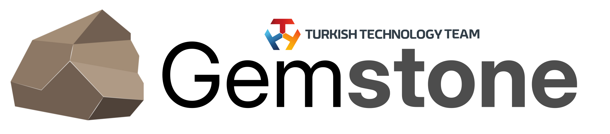

<p align="center">
    <picture>
        <source media="(prefers-color-scheme: dark)" srcset=".meta/logo-dark.png" width="40%" />
        <source media="(prefers-color-scheme: light)" srcset=".meta/logo-light.png" width="40%" />
        
    </picture>
</p>

# T3 Gemstone Toolchains

 [](https://www.t3vakfi.org/en) [](https://opensource.org/licenses/Apache-2.0) [](https://github.com/89luca89/distrobox) [](https://www.jetify.com/devbox/docs/contributor-quickstart/)

## What is it?

This project includes all the necessary work for cross compiling projects on x86-64 hosts to run on AArch64 T3 Gemstone boards.

Normally projects can be compiled natively by copying them into the board and then using the tools available in there.
But because host computers are much powerful than embedded boards we can utilize our host computer by using a
cross compilation toolchain.

All details related to the project can be found at https://docs.t3gemstone.org/en. Below, only a summary of how to perform the installation is provided.

##### 1. Install Docker and jetify-devbox on the host computer.

```bash
user@host:$ ./setup.sh
```

##### 2. After the installation is successful, activate the jetify-devbox shell to automatically install tools such as taskfile, etc.

```bash
user@host:$ devbox shell
```

##### 3. Download the toolchain.

Toolchain includes tools that are needed for cross compiling projects such as `gcc`, `g++`, `ld`, etc.

```bash
📦 devbox:sdk> task fetch
```

##### 4. Create sysroot for the cross compiler.

This step creates a minimal system based on Debian or Ubuntu using `debos` tool. You can change the packages that should be
included in the sysroot by modifying [rootfs.yml](./debos/recipes/rootfs.yml). After creating rootfs, folders needed for
cross compilation are copied into [sysroot](./build/sysroots) folder and any broken symlinks are fixed.

```bash
📦 devbox:sdk> task debos:create
📦 devbox:sdk> task debos:sysroot
```

##### 5. Compile example project using the toolchain.

```bash
📦 devbox:sdk> eval "$(task source)"
📦 devbox:sdk> task example
```

##### 5. Run compiled binary.

After completing Step 5, a binary called `hello` should be created and then copied into the debos rootfs
created earlier.

You can run this binary on your host PC with the help of `chroot` and `qemu-user-static` tools.

```bash
📦 devbox:sdk> task debos:chroot
root@ubuntu-jammy:$ hello
> Hello, world!
```
